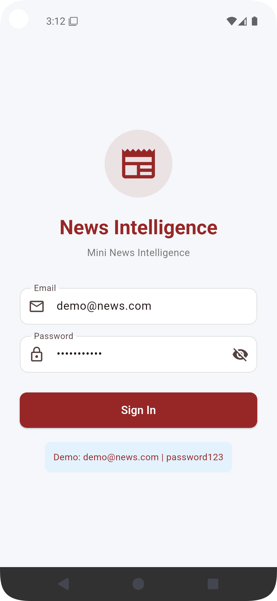
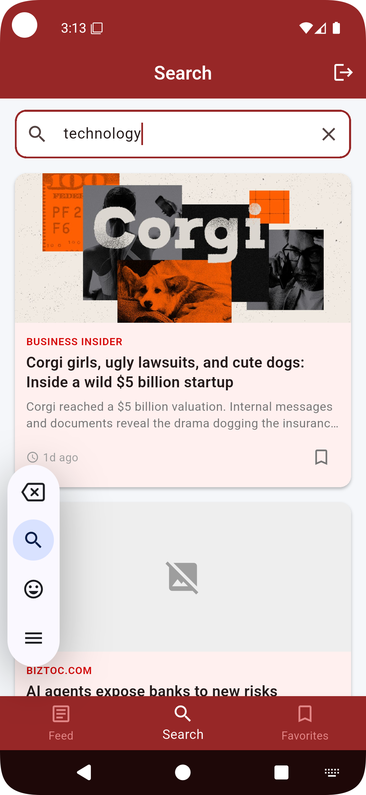
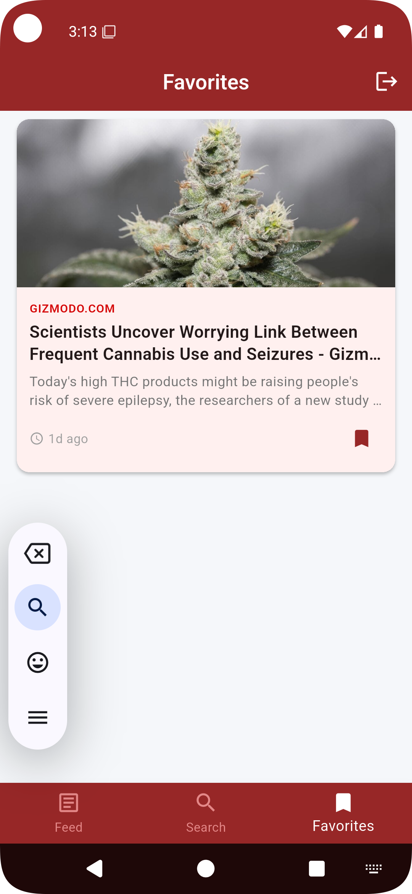

# mini_news_intl_app

A clean, scalable Flutter application that delivers a **business news intelligence** experience using a public news API.

Built as a Junior Developer assignment demonstrating:

- Clean Architecture
- Riverpod state management
- Hive local persistence
- Proper error handling & loaders
- Scalable folder structure

## Features

| Feature | Description |
|---------|-------------|
| **Authentication** | Simple login with persistent session (Hive) |
| **News Feed** | Category-based listing, pagination, pull-to-refresh |
| **Search** | Debounced API search with pagination |
| **Article Detail** | Full view + save/remove favorite |
| **Favorites** | Offline persistent storage via Hive |

## Demo Credentials

Email:    demo@news.com
Password: password123

## Architecture

mini_news_intl_app/
├── pubspec.yaml
├── README.md
├── analysis_options.yaml
├── .gitignore
└── lib/
├── main.dart
├── app.dart
├── core/
│   ├── constants/
│   │   ├── api_constants.dart
│   │   └── app_constants.dart
│   ├── errors/
│   │   ├── exceptions.dart
│   │   └── failures.dart
│   ├── network/
│   │   └── api_client.dart
│   ├── theme/
│   │   └── app_theme.dart
│   ├── utils/
│   │   └── date_utils.dart
│   └── widgets/
│       ├── empty_state.dart
│       ├── error_display.dart
│       └── loading_widget.dart
├── features/
│   ├── auth/
│   │   ├── data/
│   │   │   ├── datasources/
│   │   │   │   └── auth_local_datasource.dart
│   │   │   └── repositories/
│   │   │       └── auth_repository_impl.dart
│   │   ├── domain/
│   │   │   ├── entities/
│   │   │   │   └── user.dart
│   │   │   └── repositories/
│   │   │       └── auth_repository.dart
│   │   └── presentation/
│   │       ├── providers/
│   │       │   └── auth_provider.dart
│   │       └── screens/
│   │           └── login_screen.dart              
│   ├── news/
│   │   ├── data/
│   │   │   ├── datasources/
│   │   │   │   └── news_remote_datasource.dart
│   │   │   ├── models/
│   │   │   │   └── article_model.dart
│   │   │   └── repositories/
│   │   │       └── news_repository_impl.dart
│   │   ├── domain/
│   │   │   ├── entities/
│   │   │   │   └── article.dart
│   │   │   └── repositories/
│   │   │       └── news_repository.dart
│   │   └── presentation/
│   │       ├── providers/
│   │       │   ├── news_provider.dart
│   │       │   └── search_provider.dart
│   │       ├── screens/
│   │       │   ├── news_feed_screen.dart         
│   │       │   ├── search_screen.dart            
│   │       │   └── article_detail_screen.dart    
│   │       └── widgets/
│   │           ├── article_card.dart
│   │           └── category_chips.dart
│   └── favorites/
│       ├── data/
│       │   ├── datasources/
│       │   │   └── favorites_local_datasource.dart
│       │   └── repositories/
│       │       └── favorites_repository_impl.dart
│       ├── domain/
│       │   └── repositories/
│       │       └── favorites_repository.dart
│       └── presentation/
│           ├── providers/
│           │   └── favorites_provider.dart
│           └── screens/
│               └── favorites_screen.dart         
└── shared/
└── providers/
└── providers.dart

## Screenshots

| Login | News Feed | Search |
|:-----:|:---------:|:------:|
|  |  |  |

| Article Detail | Favorites |
|:--------------:|:---------:|
|  |  |
